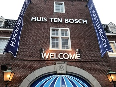

#### 日時：2019年3月4日（月）～6日（水）
#### 場所：ホテルオークラJRハウステンボス、長崎県佐世保市
#### 公式Webページ：http://db-event.jpn.org/deim2019/
上記日程にて、ハウステンボスで行われました、第11回データ工学と情報マネジメントに関するフォーラム（DEIM2019）に参加しました。大島研究室からは、高橋さん、白髪さん、ラビンさん、村本さん、楊さんの5名が、以下の内容で口頭発表と、インタラクティブ発表を行いました。
```
「分散表現空間の基底変換に基づく時系列横断の類義語トラッキング」
　高橋 克郎、大島 裕明
「飲食店レビューにおける再訪問ユーザの行動の分析」
　白髪 宙海、村本 直樹、高橋 克郎、大島 裕明
「話題提供を行うための独居家族との「気配」共有システム」
　マハルジャン ラビン、白石 晃一（京都造形芸大）、山本 岳洋（京大）、山本 祐輔（静岡大）、大島 裕明
「ソーシャルメディアからの商品の利用目的の発見」
　村本 直樹、湯本 高行、大島 裕明
「博物館の展示物と見学者の興味を関連付ける情報の発見」
　楊 澤華、山本 祐輔（静岡大）、山本 岳洋（京大）、神門 典子（NII）、大島 裕明
```


また、高橋さん、白髪さんの2名が学生プレゼンテーション賞を受賞しました！


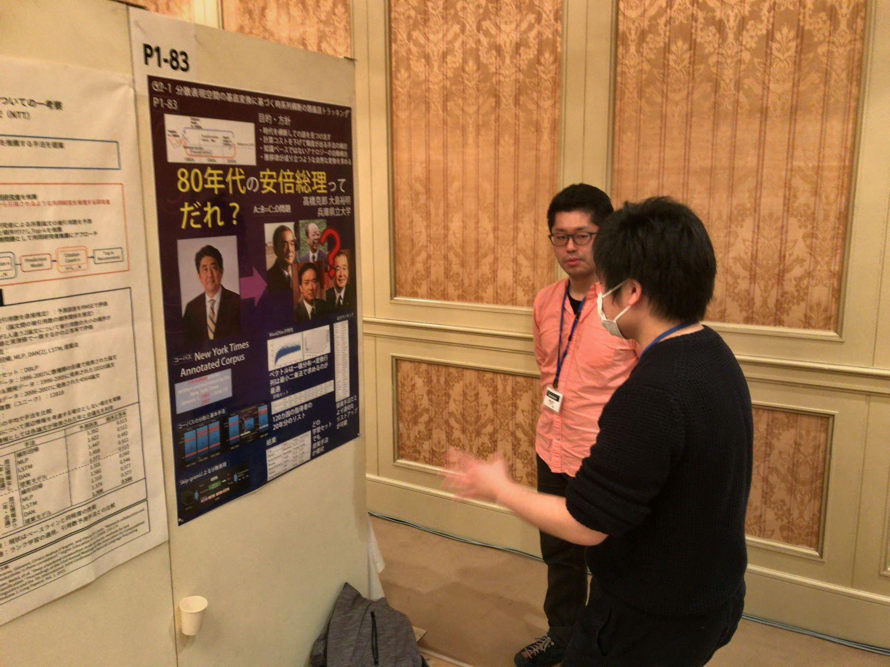

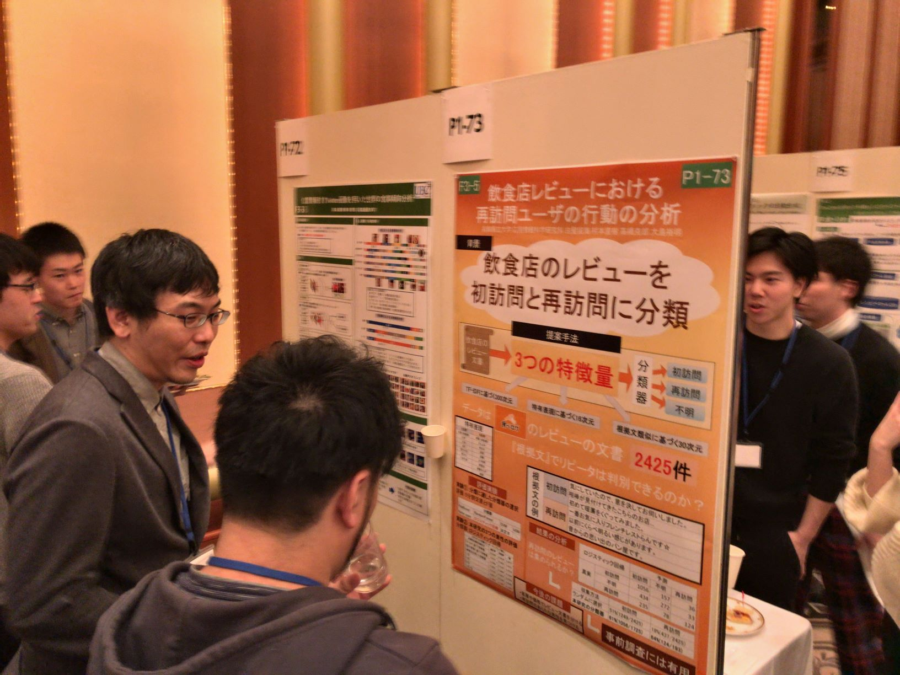

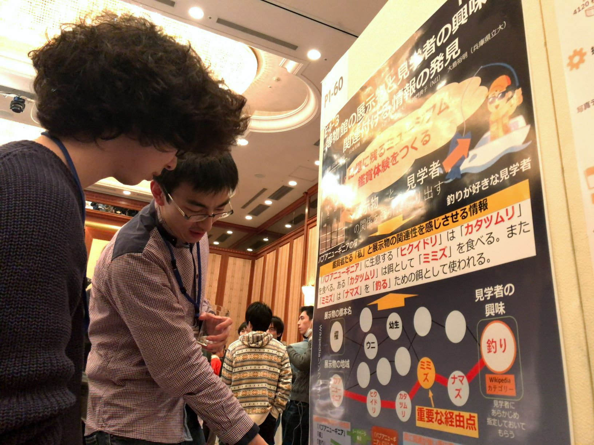

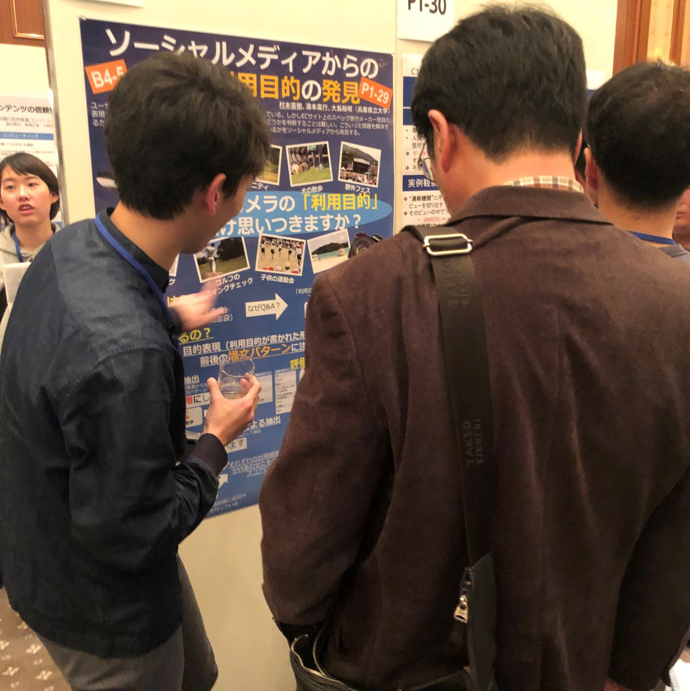

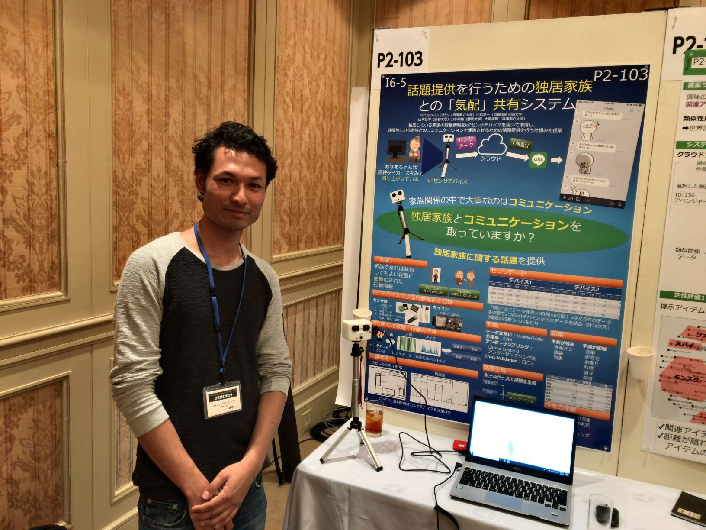

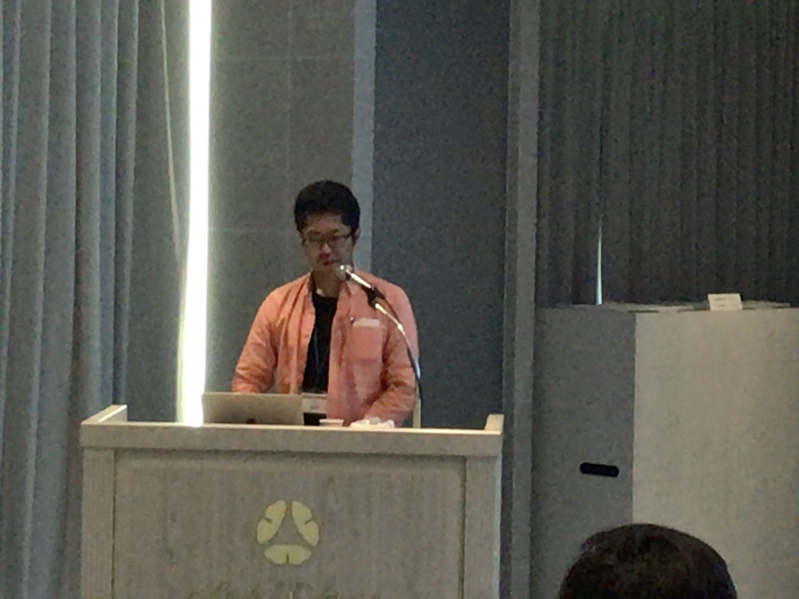

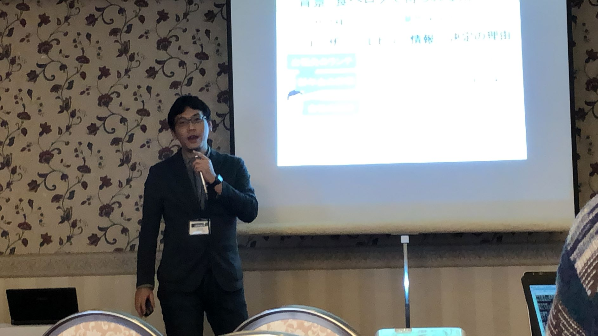

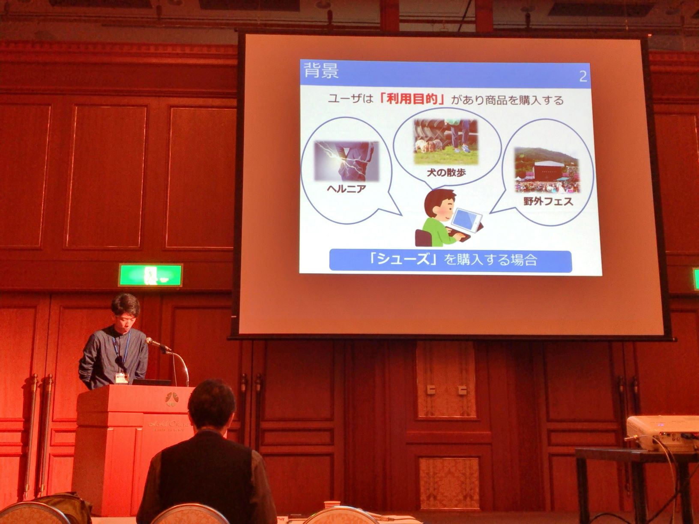

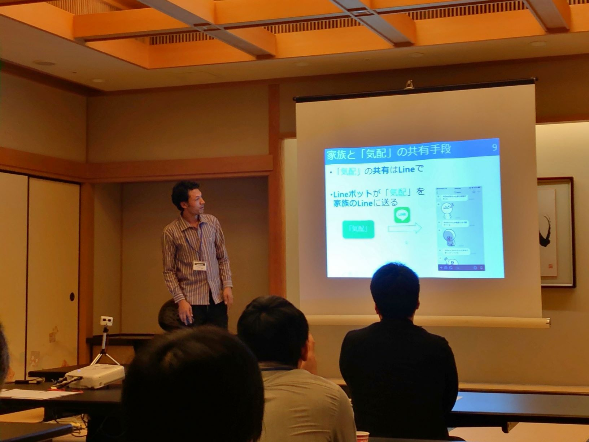

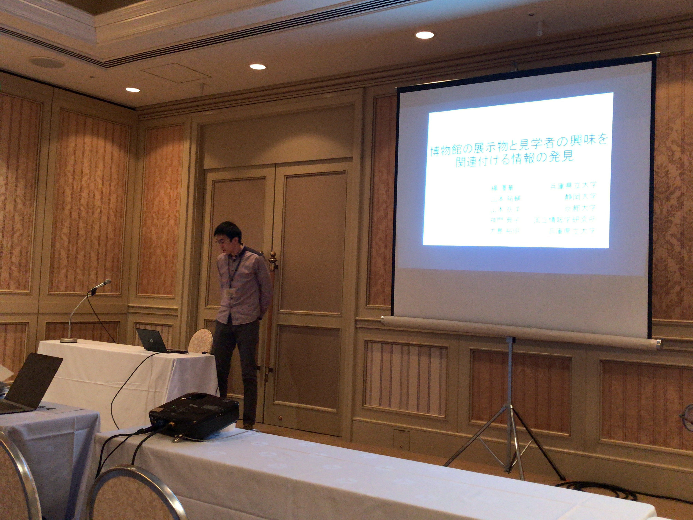

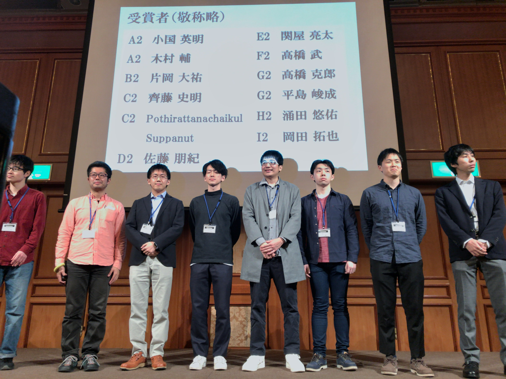

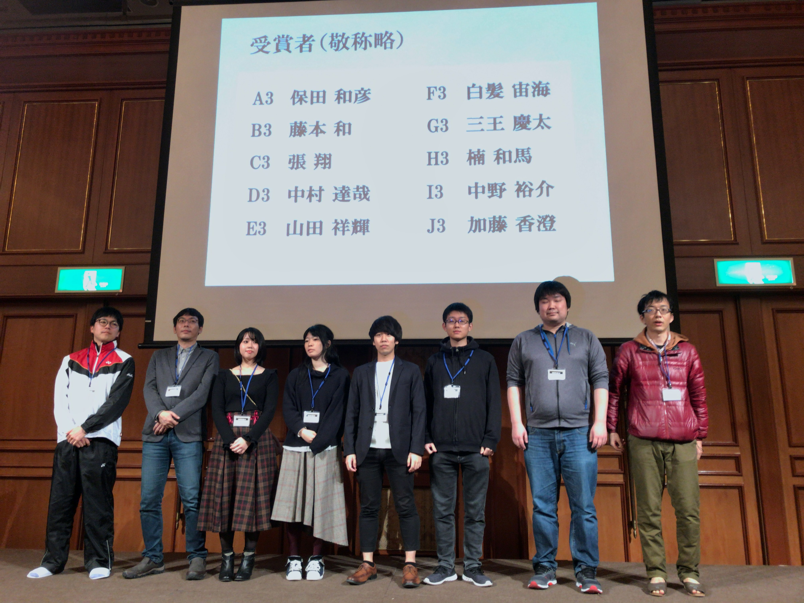
