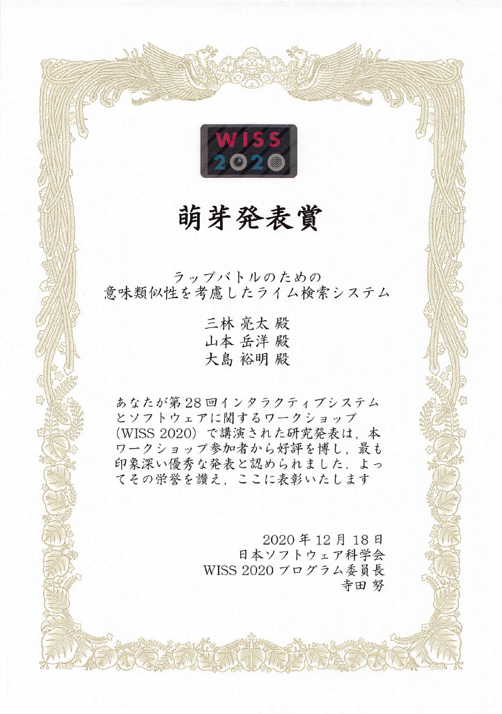

三林 亮太さんが「第28回インタラクティブシステムとソフトウェアに関するワークショップ」で発表し、萌芽発表賞を受賞しました。

+ 三林亮太, 山本岳洋, 大島裕明：「ラップバトルのための意味類似性を考慮したライム検索システム」, WISS 2020: 第29回インタラクティブシステムとソフトウェアに関するワークショップ, 2020年12月
[公式Webページ](https://www.wiss.org/WISS2020/)
