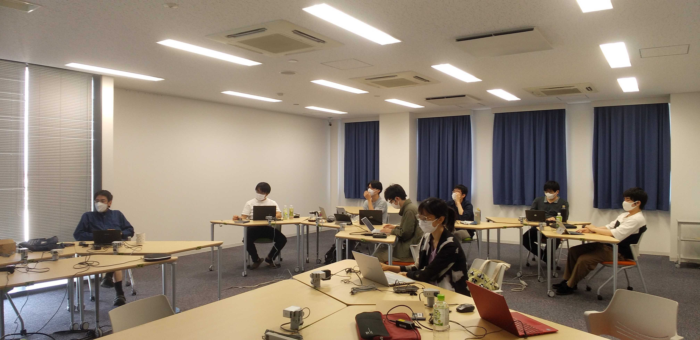
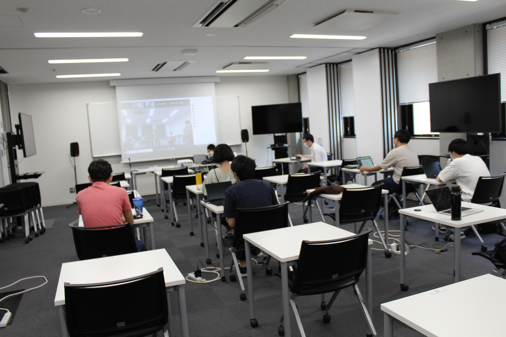

#### 日時：2021年6月30日（水）
#### 場所：兵庫県立大学神戸情報科学キャンパス、商科キャンパス、Zoom

上記日程にて、兵庫県立大学川嶋研究室、大島研究室、湯本研究室、山本研究室の4研究室で合同研究会を行いました。

川嶋研究室2名、大島研究室9名、湯本研究室2名、山本研究室3名の合計16名で発表し合いました。
M1、M2共に、活発で有意義な議論を行えました。
川嶋先生、湯本先生、山本先生ありがとうございました。

#### 各研究室・先生方のホームページ
[川嶋研究室のHP](https://interaction-lab.org/kawashima/index-j.html) 
[湯本研究室のHP](https://sites.google.com/view/yumotolab/) 
[山本研究室のHP](https://rerank-lab.org/message/)
