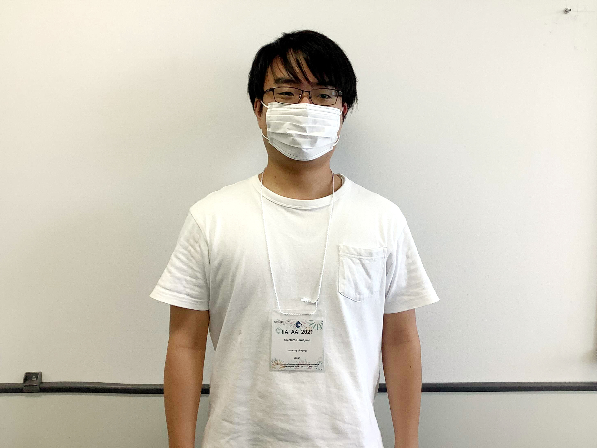

濵島 聡一郎さんが「10th International Congress on Advanced Applied Informatics (IIAI-AAI 2021)」で発表しました。

[公式Webページ](http://iaiai.org/conference/aai2021/conferences/scai-2021/)

+ Soichiro Hamajima, Takehiro Yamamoto and Hiroaki Ohshima. "Investigating Users’ Query Formulations in Consumer Health Search", 10th International Congress on Advanced Applied Informatics (IIAI-AAI 2021), July 2021.

2021年の7月11日～16日に発表。
