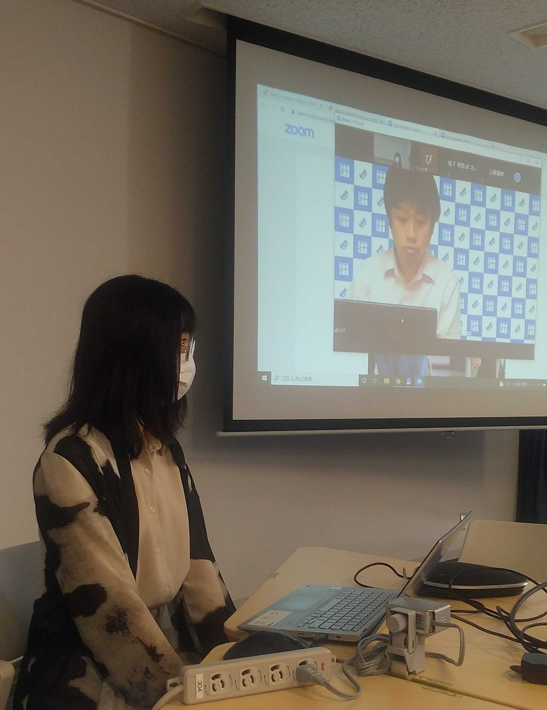
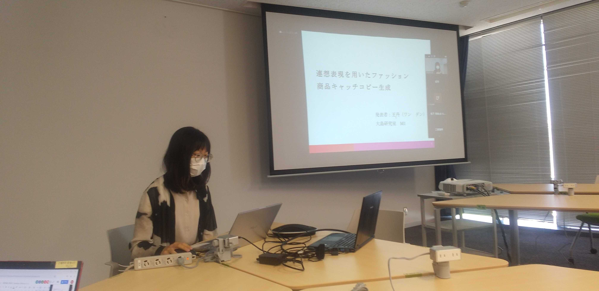
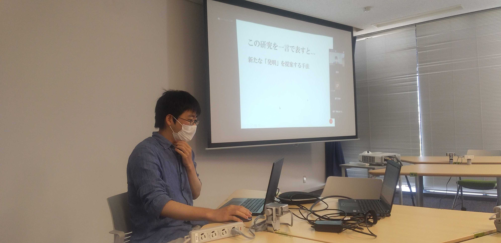
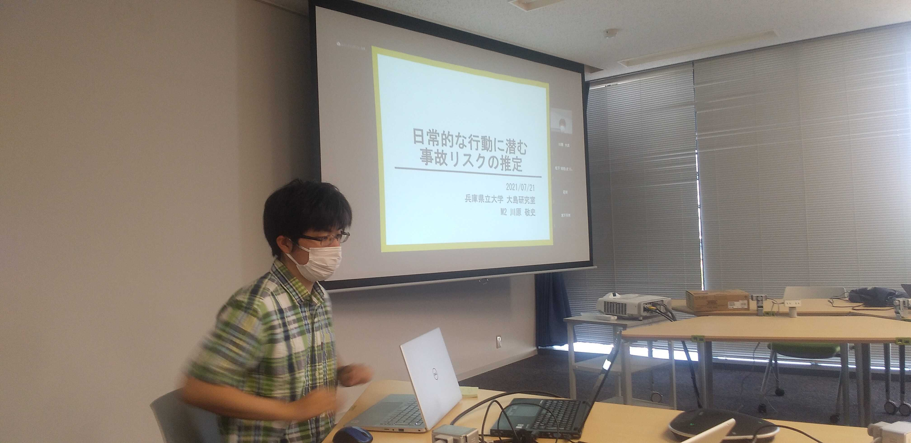
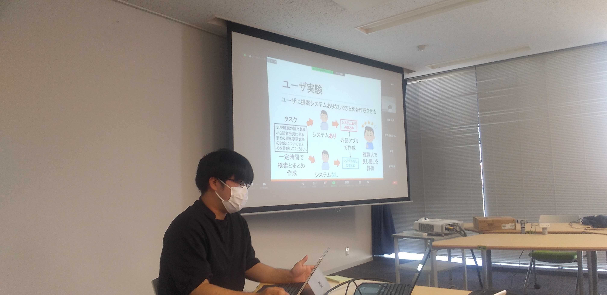
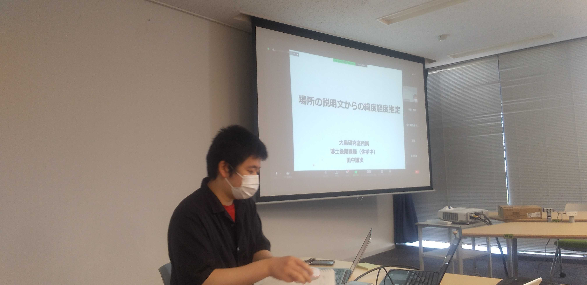

#### 日時：2021年7月21日（水）
#### 場所：兵庫県立大学神戸情報科学キャンパス、Zoom

上記日程にて、兵庫県立大学大島研究室、青山学院大学Dürst研究室で合同研究会を行いました。

大島研究室6名、青山学院大学Dürst研究室の莊司慶行先生と6名の学生の合計13名で発表し合いました。
M1、M2共に、活発で有意義な議論を行えました。
夜は、Discordにて、Among Usとお絵描き伝言ゲームを行いました。
お絵描き伝言ゲームは、いつしても珍図画が生まれて、非常に楽しいです。

青山学院大学Dürst研究室の皆様、ありがとうございました。

#### 各研究室・先生方のホームページ
[Dürst研究室のHP](https://moo.sw.it.aoyama.ac.jp) 
