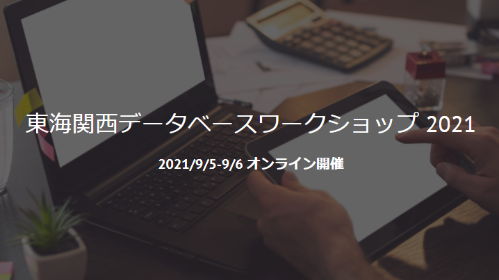
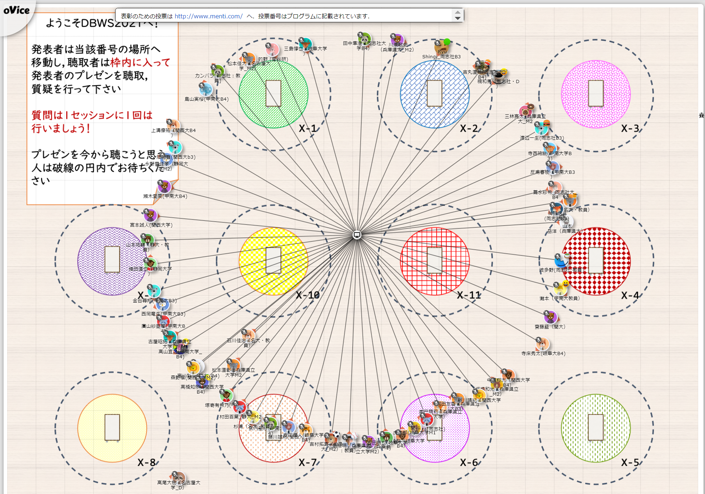
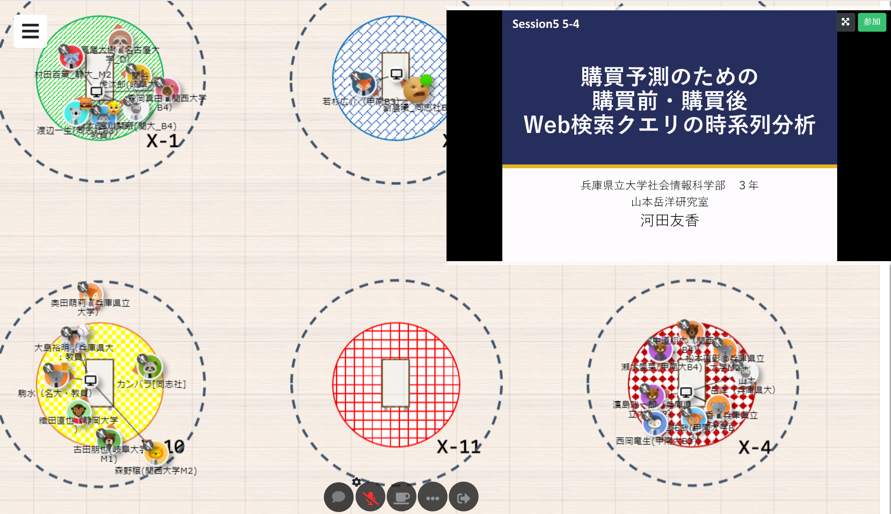
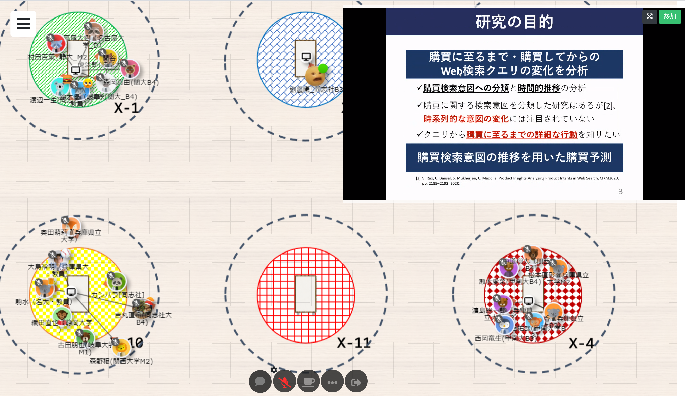
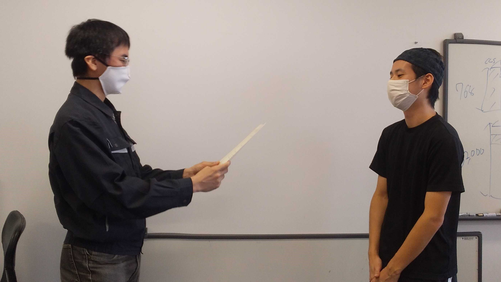
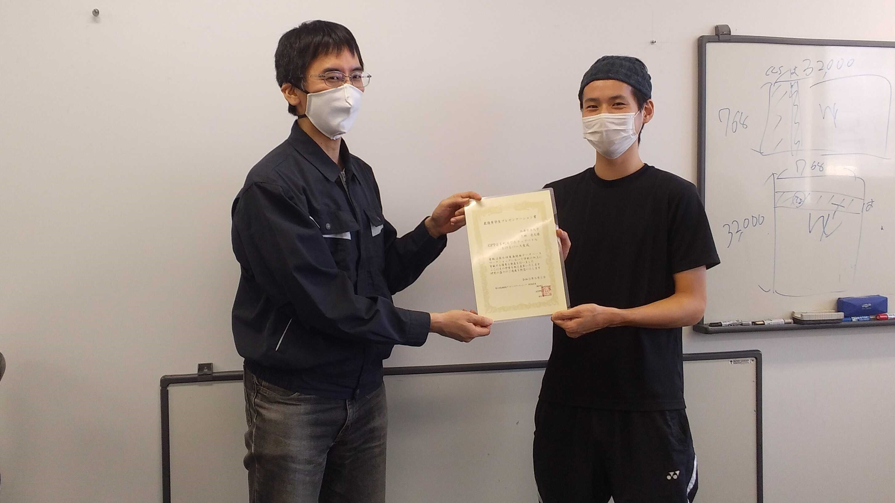

#### 日時：2021年9月5日（日）～9月6日（月）
#### 場所：oVice

上記日程にて、大島研のメンバーが東海関西データベースワークショップ 2021に参加しました。

たくさんのコメントをいただいたり、色んな研究を知ることができたりと、とても充実した2日間でした。

 

また、三林亮太さんが最優秀学生プレゼンテーション賞を受賞しました。
- 三林亮太, 最優秀学生プレゼンテーション賞, GPT-2を利用したラップバトルにおけるバース生成, 第6回東海関西データベースワークショップ, 2021年9月5日

皆さん、お疲れ様でした！

[公式webページ](https://sites.google.com/db.info.gifu-u.ac.jp/dbws2021/) 
