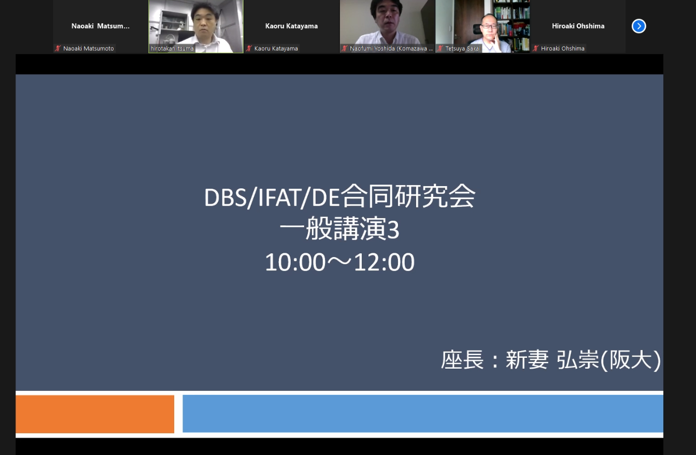
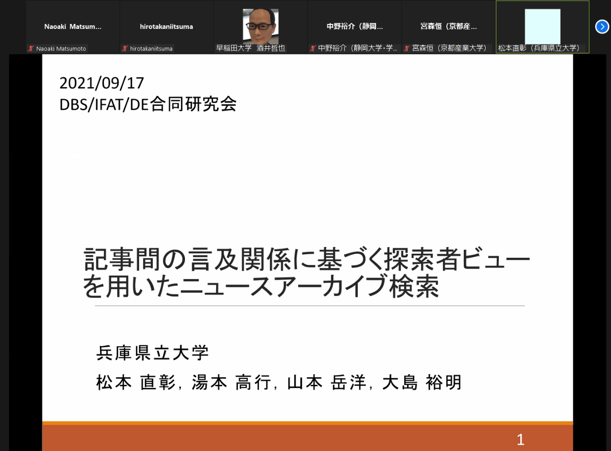
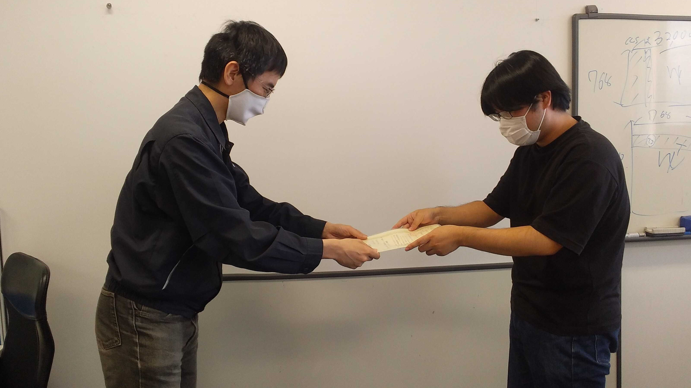
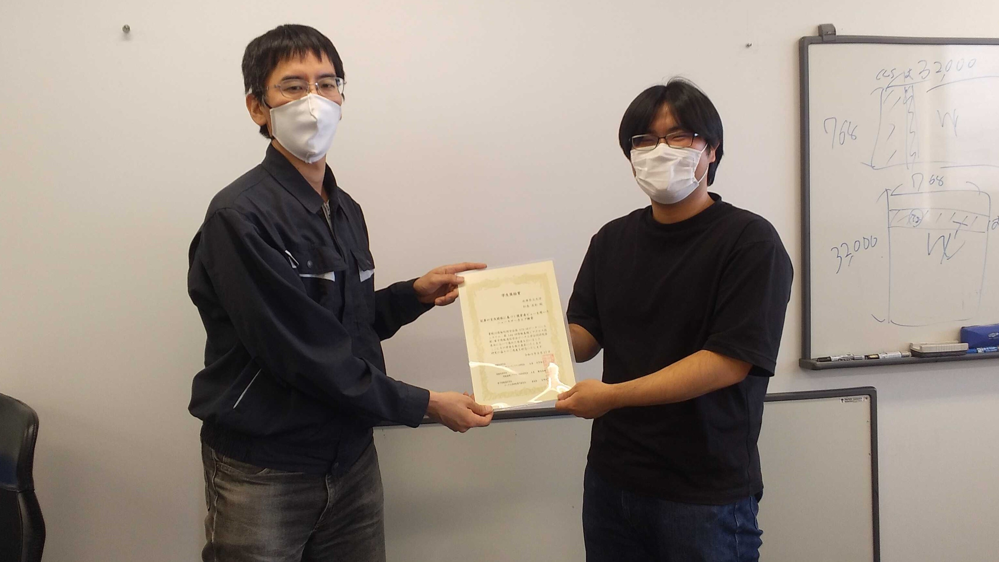

#### 日時：2021年9月16日（木）～9月17日（金）
#### 場所：Zoom

上記日程にて、松本 直彰さんが、第173回 データベースシステム研究会（SIG-DBS） 情報処理学会 第144回 情報基礎とアクセス技術研究会（SIG-IFAT） 電子情報通信学会 データ工学研究会（DE） 合同研究会で発表しました。

+ 松本直彰, 湯本高行, 山本岳洋, 大島裕明：「記事の言及関係に基づく探索者ビューを用いたニュースアーカイブ検索」, 情報処理学会データベースシステム研究会・情報基礎とアクセス技術研究会・電子情報通信学会データ工学研究会 研究報告, 2021年9月

学生奨励賞を受賞しました。
- 松本直彰, 学生奨励賞, 記事の言及関係に基づく探索者ビューを用いたニュースアーカイブ検索, 第173回 データベースシステム研究会・第144回 情報基礎とアクセス技術研究会・電子情報通信学会 データ工学研究会, 2021年9月17日

気を再び引き締めて、今後も頑張りましょう！お疲れ様でした！

[公式webページ](https://www.ipsj.or.jp/award/dbs-award1.html) 
