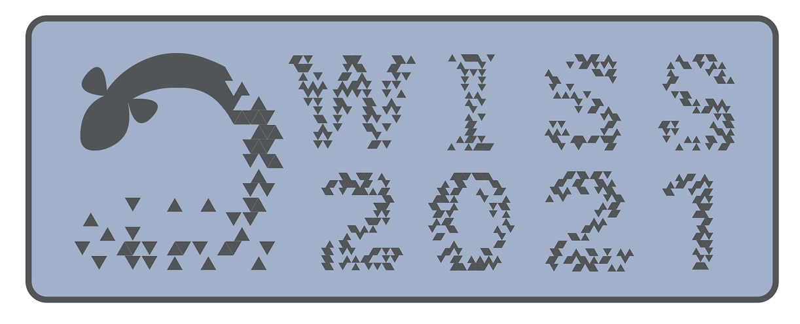
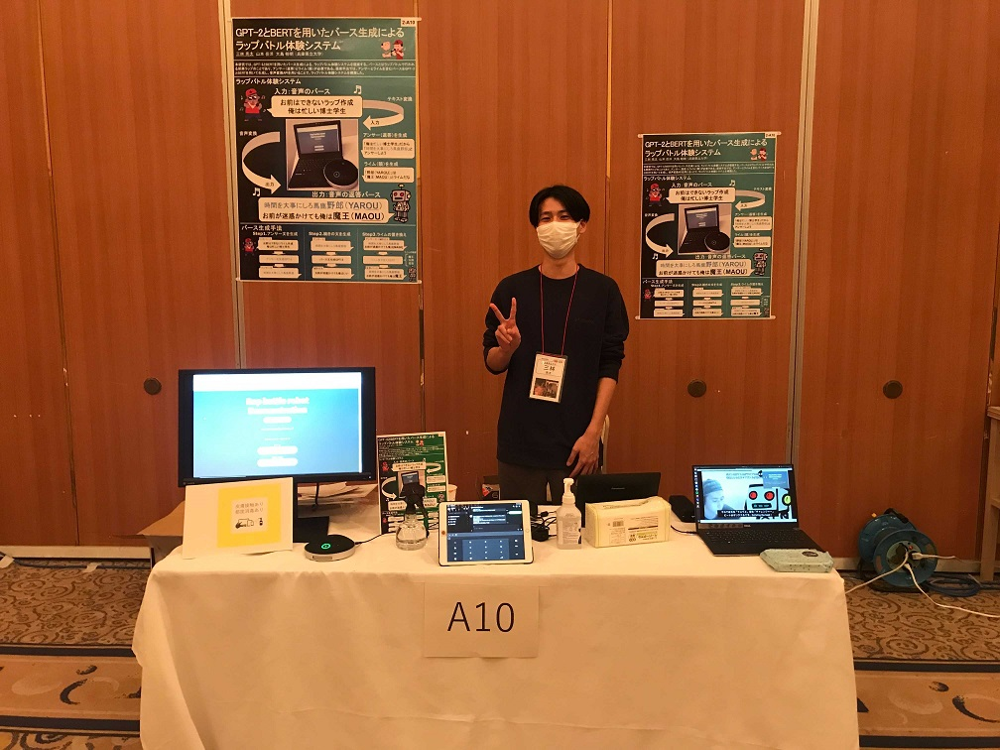

#### 日時：2021年12月8日(水)～10日(金)
#### 場所：ザ浜名湖，オンライン

三林 亮太さんが「WISS: 2021 第29回インタラクティブシステムとソフトウェアに関するワークショップ」で発表しました。

+ 三林亮太, 山本岳洋, 大島裕明：「GPT-2とBERTを用いたバース生成によるラップバトル体験システム」, WISS 2021: 第29回インタラクティブシステムとソフトウェアに関するワークショップ, 2021年12月

[公式Webページ](https://www.wiss.org/WISS2021/)

[予稿ページ](https://www.wiss.org/WISS2021Proceedings/data/2-A10.pdf)

三林さん、お疲れさまでした。
