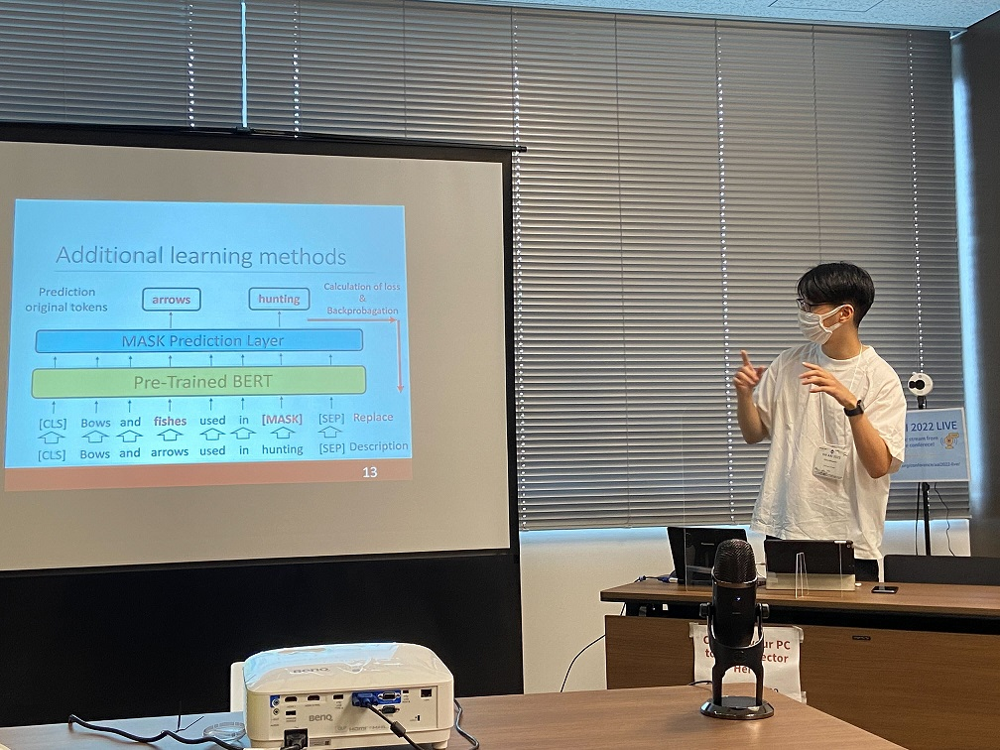
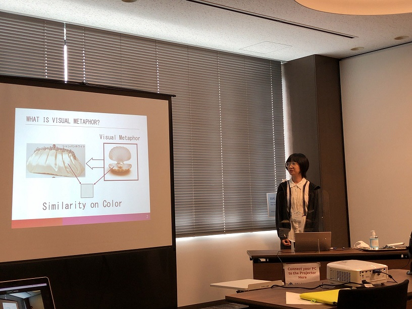

#### 日時：2022年7月4日（火）～7月6日（木）
#### 場所：ハイブリッド

三林　亮太さんと王　丹さんが「14th International Conference on E-Service and Knowledge Management (ESKM 2022)」で発表しました。
[公式Webページ](https://iaiai.org/conference/aai2022/conferences/eskm-2022/)

2022年の7月4日～6日に発表。

3日間お疲れ様でした！

+ Ryota Mibayashi, Masaki Ueta, Takafumi Kawahara, Naoaki Matsumoto, Takuma Yoshimura, Kenro Aihara, Noriko Kando, Yoshiyuki Shoji, Yuta Nakajima, Takehiro Yamamoto, Yusuke Yamamoto and Hiroaki Ohshima: "MinpakuBERT: A Language Model for Understanding Cultural Properties in Museum", Proceedings of the 12th International Congress on Advanced Applied Informatics (IIAI-AAI 2022).
+ Wang Dan, Ryota Mibayashi and Hiroaki Ohshima: " Visual Metaphor Construction for Image and Description of Fashion Goods", Proceedings of the 12th International Congress on Advanced Applied Informatics (IIAI-AAI 2022).
