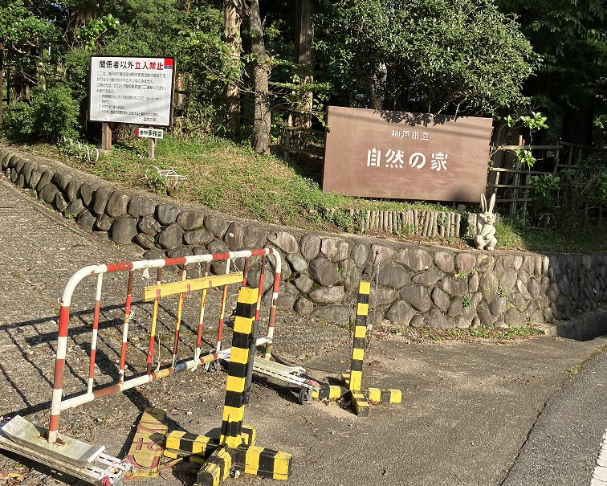

#### 日時：2022年9月11日（日）～13日（火）
#### 場所：神戸市立自然の家

2022年8月17日、神戸市立自然の家へ講座旅行に行ってきました！

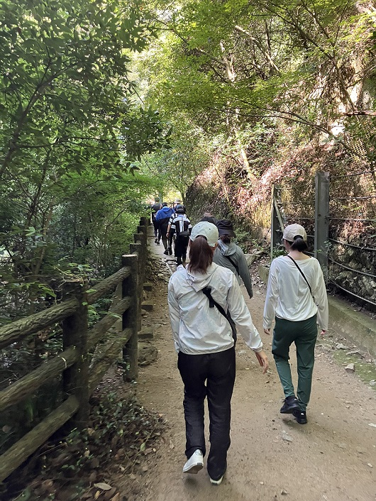

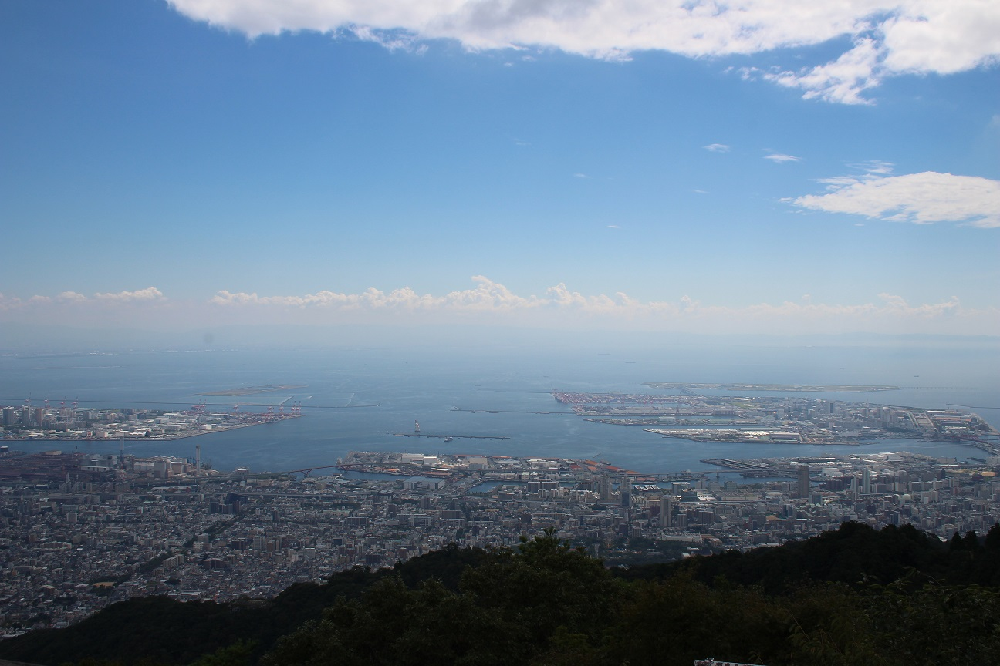
1日目は山登り。新神戸駅から布引の滝を経由して、摩耶山の掬星台へ。

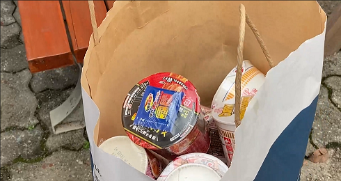
いろいろハプニングはあったものの、山を登り切って、自然の家に向かったら、カップヌードルを用意してくれました！

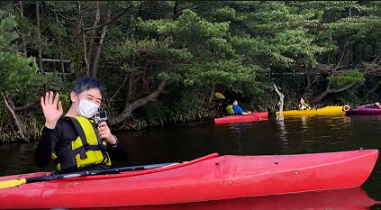
その後、カヌーをしました！

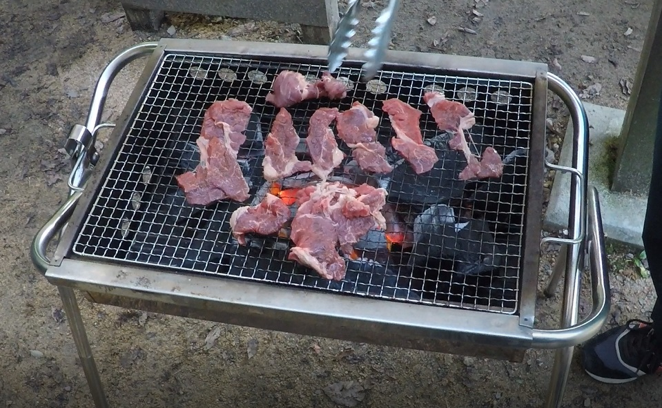
夕食はBBQ！肉がおいしかったです！

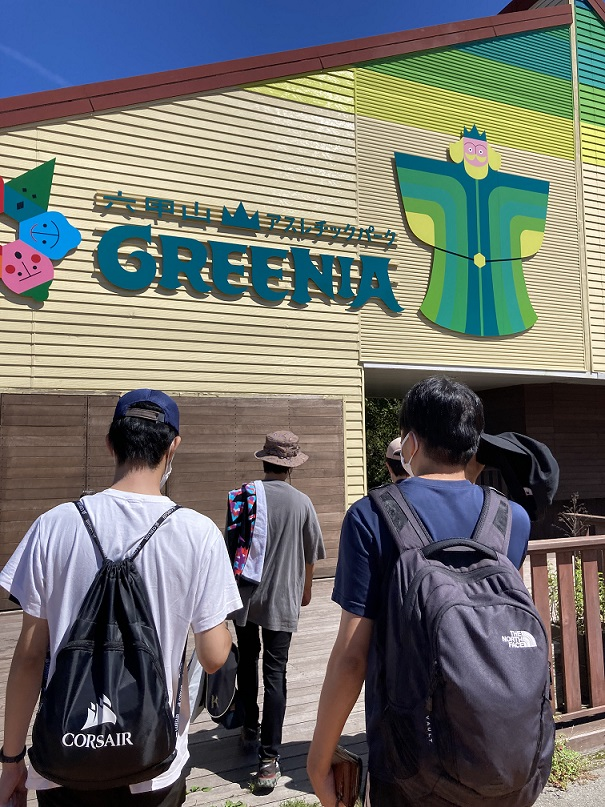
おはようございます。2日目は朝から六甲山アスレチックパークGREENIAへ行ってきました！

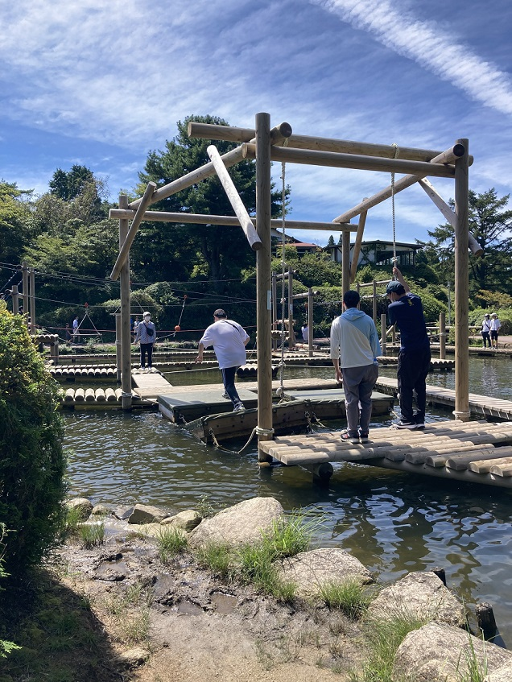
六甲山アスレチックパークでは、とにかく遊び、濡れました。。

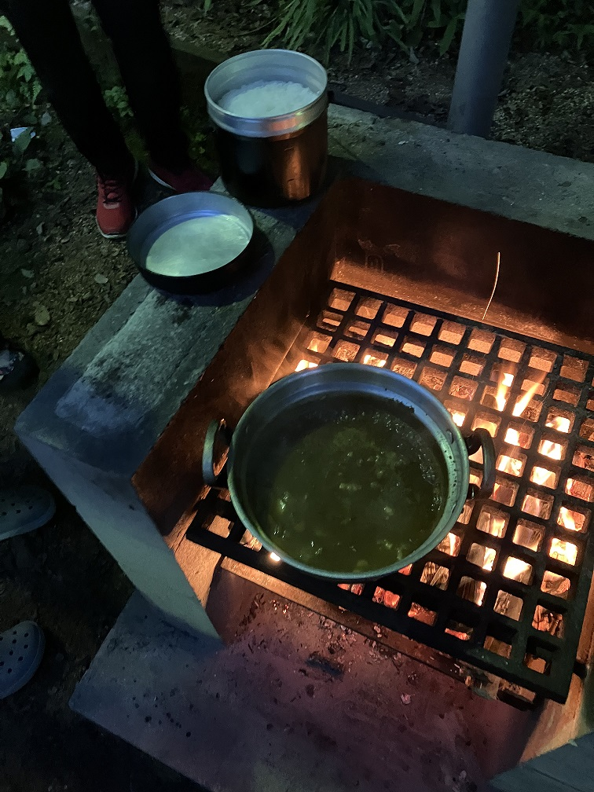
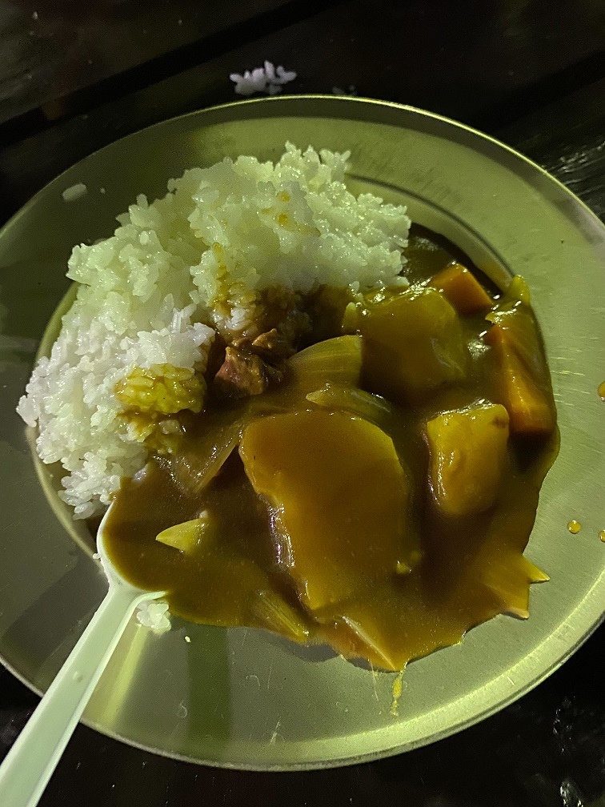
バスで帰って、その後、飯盒炊爨でした。
カレーを作りましたが、点火が大変でした。

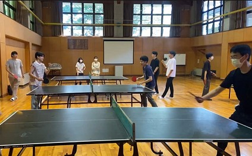
3日目の朝は、卓球をしました。

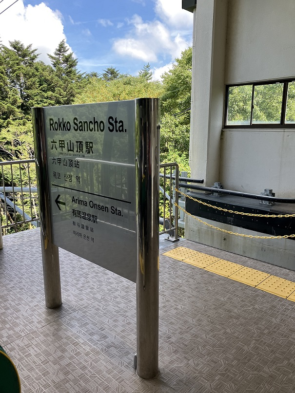
卓球後、自然の家から離れ、バスとロープウェイで有馬温泉へ。

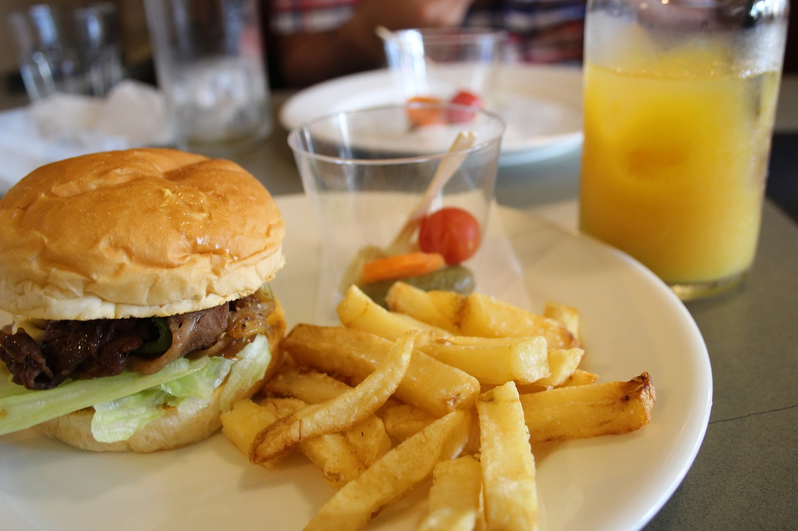
そこで食べたハンバーガーが美味しかったです！

その後、現地解散しました！お疲れ様でした！
