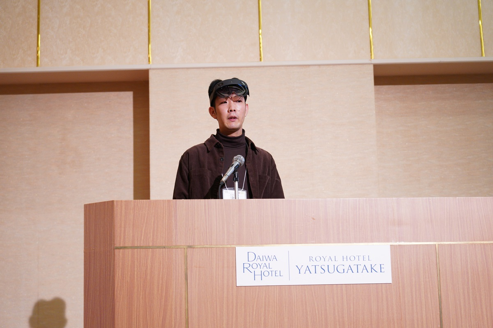
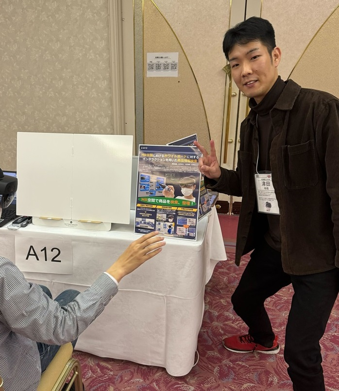

#### 日時：2023年11月29日（水）～2023年12月1日（金）
#### 場所：ロイヤルホテル八ヶ岳

M2の津田裕哉です。「第31回インタラクティブシステムとソフトウェアに関するワークショップ（WISS2023）」でデモ＆ポスター発表を行いました。

WISSは主にインタラクティブシステムに関するアイデア、技術に関するワークショップです。山間のホテルに学生や教員が一緒に泊まり、深夜までお酒を飲みながら議論したりデモしたりするとても楽しい学会でした。

書誌情報は以下の通りです。
- 津田裕哉，山本岳洋，大島裕明，MR空間におけるホワイトボードに対するインタラクションを用いた商品情報検索，第31回インタラクティブシステムとソフトウェアに関するワークショップ，2023

[WISS2023公式サイト](https://www.wiss.org/WISS2023/)
