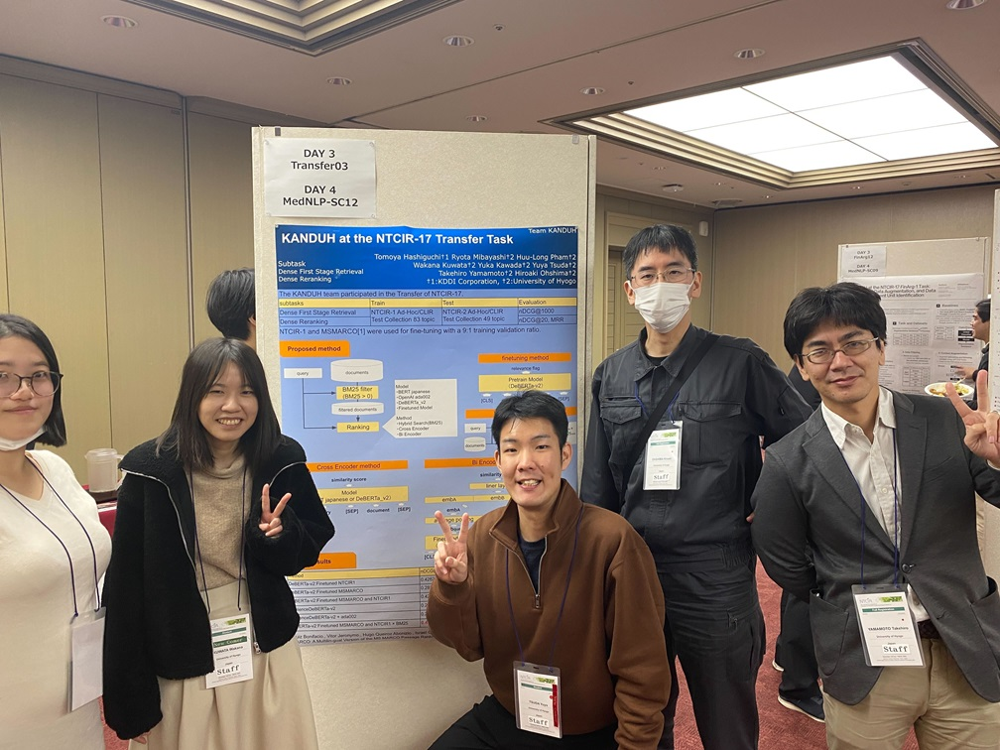
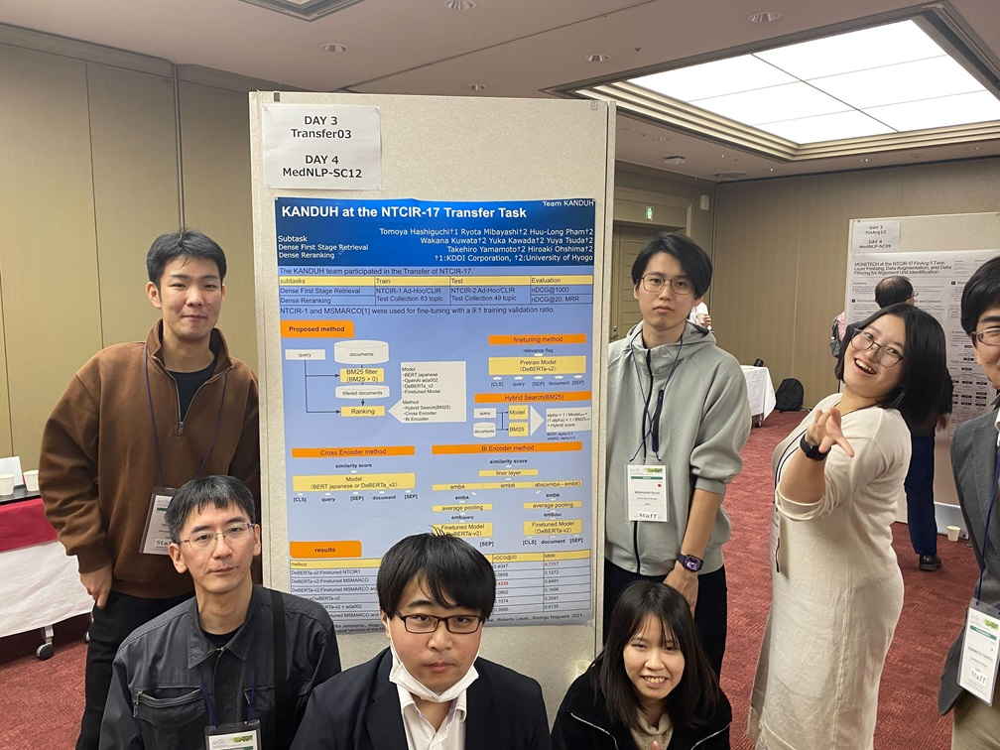

#### 日時：2023年12月12日（火）～2023年12月15日（金）
#### 場所：一橋講堂 中会議場

大島研のメンバーがThe 17th NTCIR Conferenceに参加しました。

書誌情報は以下の通りです。
- Tomoya Hashiguchi, Ryota Mibayashi, Huu-Long Pham, Wakana Kuwata, Yuka Kawada, Yuya Tsuda, Takehiro Yamamoto and Hiroaki Ohshima: "KANDUH at the NTCIR-17 Transfer Task", Proceedings of the 17th NTCIR Conference, December 2023.

[NTCIR-17 Conference公式サイト](https://research.nii.ac.jp/ntcir/ntcir-17/conference.html)
