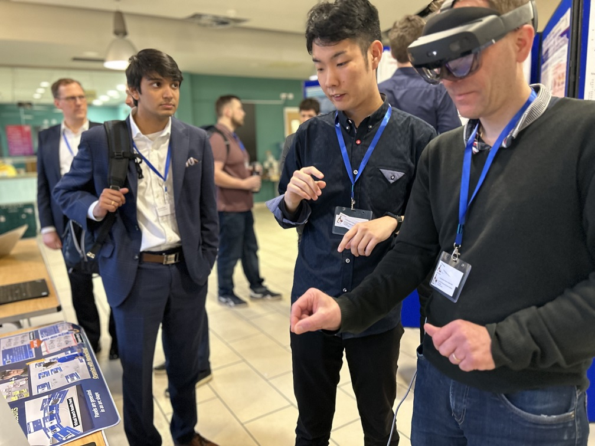
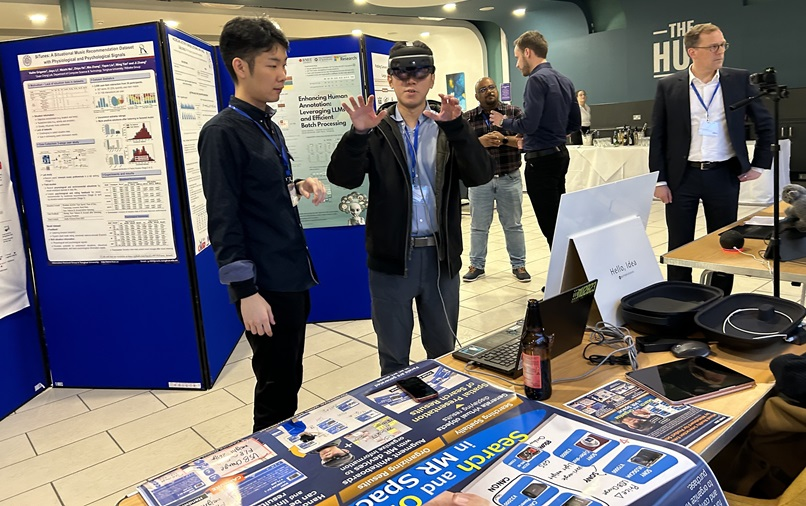

#### 日時：2024年3月10日（日）～2024年3月14日（木）
#### 場所： シェフィールド大学 (Sheffield, UK) 

津田裕哉さんの論文が国際会議The 2024 ACM SIGIR Conference on Human Information Interaction and Retrieval (CHIIR 2024)に採択されました。

CHIIR 2024は3月10日から3月14日にかけてイギリスのシェフィールドで開催され、口頭発表を行いました。

書誌情報は以下の通りです。
- Yuya Tsuda, Takehiro Yamamoto and Hiroaki Ohshima: "Mixed Reality Interaction Enhanced by Whiteboard for Product Search", Proceedings of the 2024 Conference on Human Information Interaction and Retrieval (CHIIR 2024), pp.396-400, March 2024.

[CHIIR 2024公式サイト](https://chiir2024.github.io)
