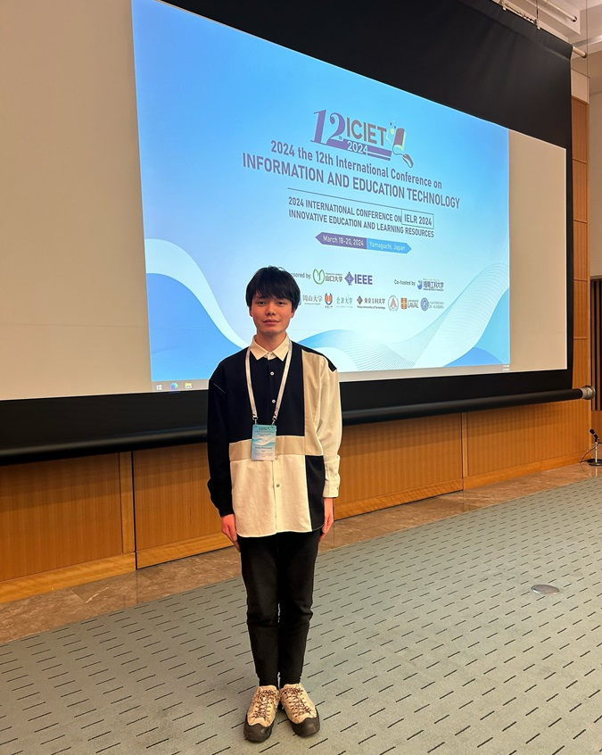

#### 日時：2024年3月18日（月）～2024年3月20日（水）
#### 場所：海峡メッセ下関 

西本海生さんの論文が国際会議「2024 12th International Conference on Information and Education Technology (ICIET 2024)」に採択されました。

カンファレンスが3月18日から3月20日にかけて開催され口頭発表を行いました。

書誌情報は以下の通りです。
- Kaisei Nishimoto, Kenro Aihara, Noriko Kando, Yoshiyuki Shoji, Yusuke Yamamoto, Takehiro Yamamoto, Hiroaki Ohshima: "A Gamification System for Acquiring Appreciation Perspectives in Museum", Proceedings of the 12th International Conference on Information and Education Technology (ICIET 2024), March 2024.

[ICIET 2024公式サイト](https://www.iciet.org/index.html)
