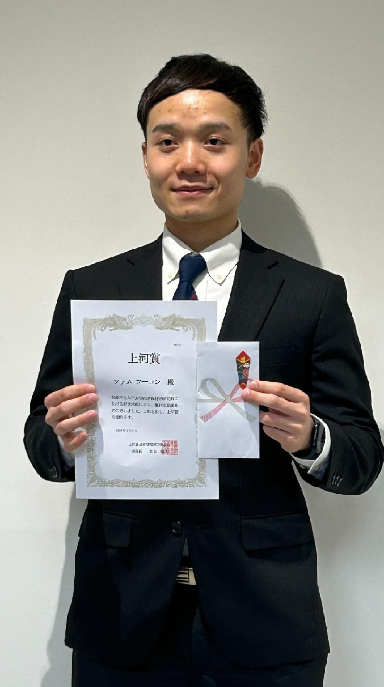

#### 日時：2025年3月27日（木）
#### 場所：神戸商科キャンパス

ファムフーロンさんが上河賞を受賞しました。
おめでとうございます！

参考URL：  
https://www.u-hyogo.ac.jp/g3s/econ/education/index.html

書誌情報：  
Huu-Long Pham, Ryota Mibayashi, Takehiro Yamamoto, Makoto P.KATO, Yusuke Yamamoto, Yoshiyuki Shoji, Hiroaki Ohshima: Pre-trained BERT Model Retrieval: Inference-Based No-Learning Approach using k-Nearest Neighbour Algorithm，IEICE Transactions on Information and Systems, 2025．(To appear)
